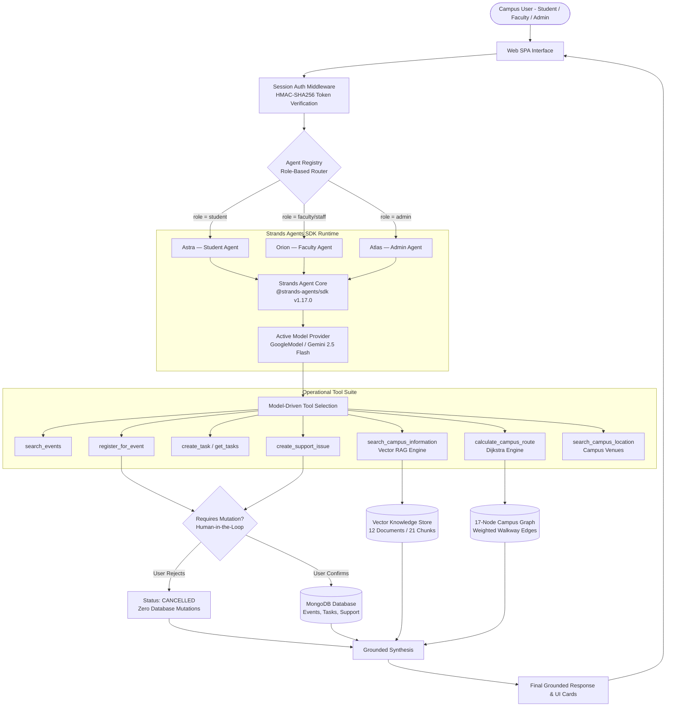

# System Architecture — Multi-Agent Campus Assistant

## 3 AI Agents. 1 Campus.

This document describes the complete architecture of the **Multi-Agent Campus Assistant** built with the **Strands Agents SDK (v1.17.0)**.

---

### High-Level System Architecture



---

### Detailed Architectural Flow

```
User
  │
  ▼
Web UI (Vanilla JS SPA / Leaflet Map / Chat View)
  │
  ▼
Authentication Middleware (/api/agent/chat)
  ├── Extracts HMAC-SHA256 Session Token (Header: Authorization / x-session-token)
  ├── Validates Signature and Scopes: id, role, department
  └── Blocks Arbitrary Header Spoofing (Returns HTTP 403)
  │
  ▼
Agent Registry (agentRegistry.js)
  ├── student       ──► Astra Agent (10 Authorized Tools)
  ├── faculty/staff ──► Orion Agent (9 Authorized Tools)
  └── admin         ──► Atlas Agent (7 Authorized Tools)
  │
  ▼
Strands Agents SDK (@strands-agents/sdk v1.17.0)
  ├── Initializes Dedicated Agent Instance per Role
  ├── Injects System Prompt & Isolated Conversation Memory
  └── Dispatches to Configured Model Provider (GoogleModel / Gemini 2.5 Flash)
  │
  ▼
Model-Selected Operational Tool
  ├── Event Search & Registration (strandsTools.js)
  ├── Campus Regulatory Vector RAG (ragService.js)
  ├── Campus Venues Directory (campusLocationsTool.js)
  └── Shortest-Path Walkway Navigation (campusGraph.js)
  │
  ▼
Human-in-the-Loop Approval Engine
  ├── Generates 15-minute TTL Single-Use Approval Token (appr_*)
  ├── Renders Action Card in UI (Confirm / Cancel)
  ├── If Cancelled ──► Emits status: CANCELLED, 0 mutations to MongoDB
  └── If Approved  ──► Executes Atomic MongoDB Write ($inc, $push)
                       Marks Token Resolved (Guarantees Replay Protection)
  │
  ▼
Final Grounded Response Generation
  ├── Returns Confirmation Message
  ├── Embeds Citations & Source Regulations
  └── Emits Interactive Map Coordinates / Status Cards
```

---

### Three Independent Agents & Boundaries

| Dimension | Astra (Student Agent) | Orion (Faculty Agent) | Atlas (Admin Agent) |
| :--- | :--- | :--- | :--- |
| **System Role** | Student campus companion | Faculty operations assistant | Administrative coordinator |
| **Tool Count** | 10 tools | 9 tools | 7 tools |
| **Exclusive Capabilities** | Event self-enrollment, assignment tasks | Faculty leave policy RAG, research grants | Administrative analytics, audit traces |
| **Security Boundary** | Blocked from faculty leave & admin records | Blocked from admin analytics & student tasks | Requires verified administrator credentials |
| **Autopilot Support** | Unregistered event & task reminders | Departmental schedule alerts | Cross-campus SLA & ticket escalations |

---

### Data Storage & Persistence Layer

* **MongoDB Models**:
  * `Event`: Event details, organizer, venue, category, and array of registered user objects.
  * `Task`: Deadlines, reminders, priorities, and user ownership.
  * `Notification`: Campus alerts, event confirmations, and status updates.
  * `SupportIssue`: IT/Facilities tickets with unique ticket ID tracking.
  * `AgentExecution`: Comprehensive audit trails of all agent tool choices, latencies, and statuses.
* **Vector Knowledge Store**:
  * 12 institutional regulatory documents divided into 21 semantic vector chunks.
  * Term-frequency inverse document frequency (TF-IDF) embeddings with cosine similarity matching.
* **Campus Graph**:
  * 17 geo-referenced campus nodes with bidirectional weighted walkway edges.
  * Dijkstra shortest-path pathfinding calculating walking distance and step-by-step HUD directions.
